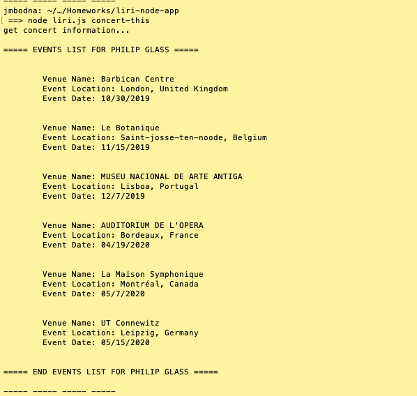
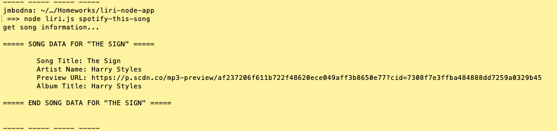
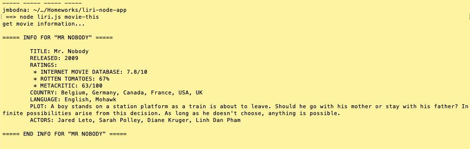
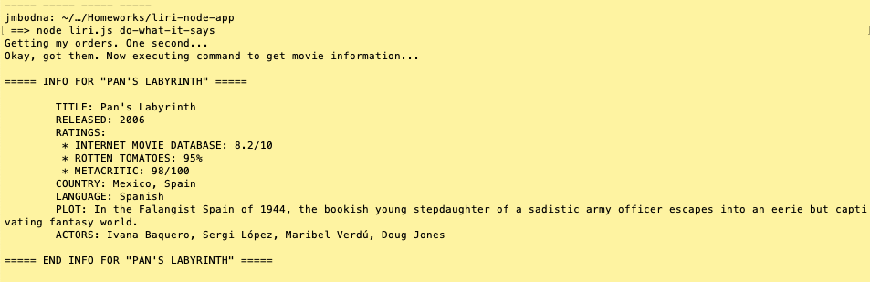

# Language Interpretation and Recognition Interface (LIRI)

A command line node app that takes parameters and returns data. Liri searches Spotify for songs, Bands in Town for concerts, and OMDB for movies.

## Dependencies

- [Node-Spotify-API](https://www.npmjs.com/package/node-spotify-api)

- [Axios](https://www.npmjs.com/package/axios) and [OMDB API](http://www.omdbapi.com) and [Bands In Town API](http://www.artists.bandsintown.com/bandsintown-api)

- [Moment](https://www.npmjs.com/package/moment)

- [DotEnv](https://www.npmjs.com/package/dotenv)

## Commands

- `concert-this`
- `spotify-this-song`
- `movie-this`
- `do-what-it-says`

### Examples

1. `node liri.js concert-this <artist/band name>` searches the Bands in Town Artist Events API for venu name, venue location, event date (MM/DD/YYYY)

2. `node liri.js spotify-this-song <song name here>` displays artist(s), song name, link to spotify preview, and album.

3. `node liri.js movie-this <movie name here>` displays movie title, release date, IMDB rating, Rotten Tomatoes rating, country, language, plot and actors.

4. `node liri.js do-what-it-says` run a randomly generated command.

